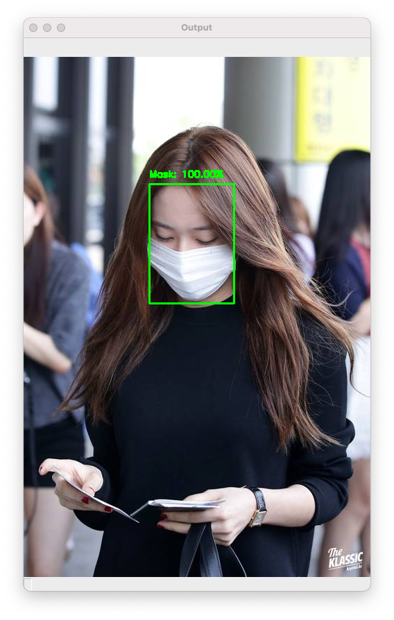

# face-mask-detector




```

# Train
python3 train_mask_detector.py --dataset dataset

# face mask detection in images
python3 detect_mask_image.py --image examples/001.jpg

# face mask detector in real-time video streams
python3 detect_mask_video.py

```

Source: https://www.pyimagesearch.com/2020/05/04/covid-19-face-mask-detector-with-opencv-keras-tensorflow-and-deep-learning/